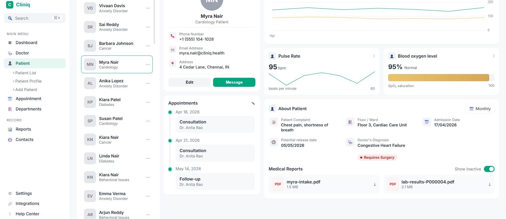

# Cliniq

A synthetic healthcare patient-management dashboard. Generates 500 realistic patient records, runs exploratory analysis, and renders them in a clinical-style UI.



## What's inside

| Agent | What it does | Output |
|---|---|---|
| `data-engineer` | Generates 500 patients with demographics, daily vitals, appointments, and diagnoses. Values are clinically correlated (e.g. Cardiology patients trend hypertensive; Cancer patients have lower SpO₂). | `/data/*.csv` |
| `eda-agent` | Explores the generated data — condition mix, vitals by condition, admission trends, surgery rates, age distributions, severity. | `/eda/*.png` + `summary.md` |
| `dashboard-agent` | Single-file HTML dashboard styled as a clinical patient-management UI. | `/dashboard/index.html` |

All three agents share `CLAUDE.md` as their spec.

## Project layout

```
cliniq/
├── CLAUDE.md               shared spec for all agents
├── scripts/
│   ├── generate_data.py    data-engineer pipeline
│   └── run_eda.py          eda-agent pipeline
├── data/                   generated CSVs + SCHEMA.md
├── eda/                    7 PNG charts + summary.md
├── dashboard/index.html    interactive dashboard (Papa Parse + Chart.js)
└── docs/dashboard.png      screenshot
```

## Quick start

```bash
# 1. Generate the dataset (500 patients, ~4000 vital readings, 1500 appointments)
python scripts/generate_data.py

# 2. Run EDA — writes charts + summary.md to /eda
python scripts/run_eda.py

# 3. Serve the dashboard (browsers block file:// CSV loads)
python -m http.server 8000
# then open http://localhost:8000/dashboard/
```

Requirements: Python 3.10+, `pandas`, `matplotlib`. No build step for the dashboard — Papa Parse and Chart.js are loaded from CDN.

## Dataset

- `patients.csv` — 500 rows. Conditions: Cardiology, Anxiety Disorder, Cancer, Diabetes, Anesthesiology, Behavioral Issues. Wards and floors are condition-specific; doctors are specialty-matched.
- `vitals.csv` — ~4,000 daily readings per admission period. Systolic/diastolic BP, pulse, SpO₂, all scaled by age, condition, and severity.
- `appointments.csv` — 3 per patient: initial Consultation, mid-stay visit, post-release Follow-up. Post-Surgical Care appears for surgical wards only.
- `diagnoses.csv` — one weighted diagnosis per patient with severity, `requires_surgery` flag, and projected release date.

Seed fixed at `42` for reproducibility.

## EDA highlights

- **Condition mix**: Cardiology leads (23%), then Cancer/Diabetes (18% each), Anxiety (17%), Behavioral (13%), Anesthesiology (12%).
- **Vitals signatures**: Cardiology is hypertensive (avg 147/87 mmHg); Cancer has lowest SpO₂ (93.9%); Anxiety has highest pulse (85 bpm).
- **Surgery rate**: Anesthesiology 91%, Cancer 62%, Cardiology 46%; psychiatric conditions ~0%.
- **Severity**: 41 patients (8.2%) Critical, 135 Severe.

Full findings in [`eda/summary.md`](eda/summary.md).

## Dashboard

- Sidebar navigation (Dashboard, Doctor, Patient, Appointment, Departments, Reports, Contacts, Settings, Integrations, Help).
- Patient Queue — scrollable roster with All / Old / New filters.
- Patient Profile — avatar, contact info, Edit / Message actions.
- Vitals — Blood Pressure line chart (systolic + diastolic), Pulse Rate sparkline, Blood Oxygen bar.
- Appointments timeline with green-dot connector.
- About Patient grid (complaint, floor/ward, dates, diagnosis, surgery badge) + Medical Reports.

Clicking any patient in the queue updates every panel.

## License

MIT — use freely.
